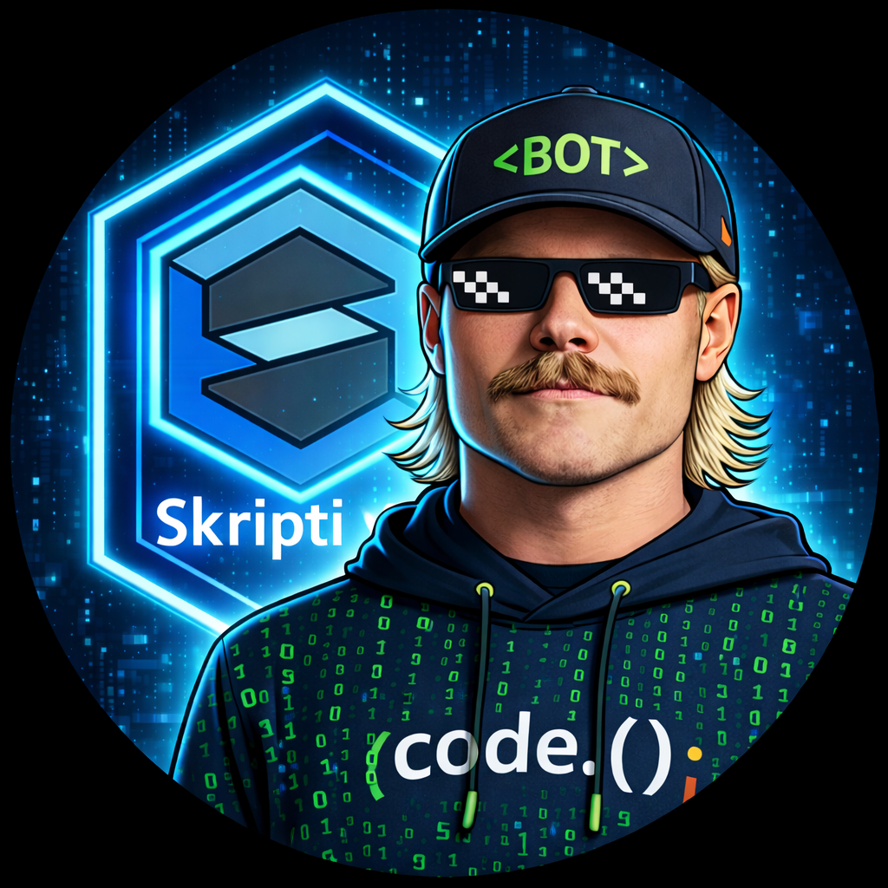
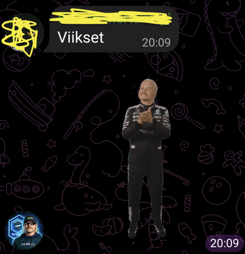

# BOTtas

BOTtas on Telegram-huumoribotti, joka spämmiä Bottas-aiheisia stickereitä
trigger-sanoista

## Ominaisuudet
- Reagoi määriteltyihin trigger-sanoihin
- Lähettää Bottas-stickereitä (file_id)
- Helppo laajentaa komennoilla
- Ajettavissa Raspberry Pi:llä

  

---

## Vaatimukset
- Python 3.9+
- Telegram Bot Token (BotFather)
- Telegram-ryhmä, johon botti lisätään
- (Suositus) Raspberry Pi tai Linux-palvelin
